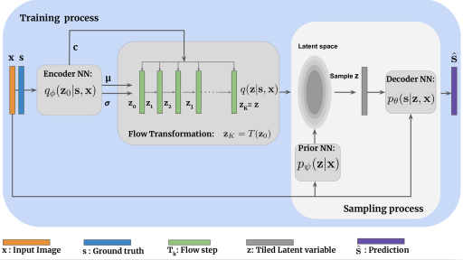

# README #

This is official Pytorch implementation of 
"[Uncertainty quantification in medical
image segmentation with Normalizing Flows](https://arxiv.org/abs/2006.02683)", Raghavendra Selvan et al. 2020


### What is this repository for? ###

* Train the proposed model on LIDC and Retina datasets
* Reproduce the reported numbers in the paper
* v1.0

### How do I get set up? ###

* Basic Pytorch dependency
* Tested on Pytorch 1.3, Python 3.6 
* Download preprocessed LIDC dataset [from here](https://sid.erda.dk/share_redirect/BgFgw4NMf4). ** Change the file name with .zip after downloading. **

### Usage guidelines ###

* Kindly cite our publication if you use any part of the code
```
@inproceedings{raghav2020cFlowNet,
 	title={Uncertainty quantification in medical image segmentation with Normalizing Flows},
	author={Raghavendra Selvan, Frederik Faye, Jon Middleton, Akshay Pai},
 	booktitle={11th International Workshop on Machine Learning in Medical Imaging},
	month={October},
	year={2020}
	url={https://arxiv.org/abs/2006.02683}}

```

### Who do I talk to? ###

* raghav@di.ku.dk

### Thanks 
Some parts of our implementation are based on:
* [Prob.U-Net and LIDC data](https://github.com/stefanknegt/Probabilistic-Unet-Pytorch)
* [Planar flows](https://github.com/riannevdberg/sylvester-flows)
* [Glow model](https://github.com/karpathy/pytorch-normalizing-flows)
